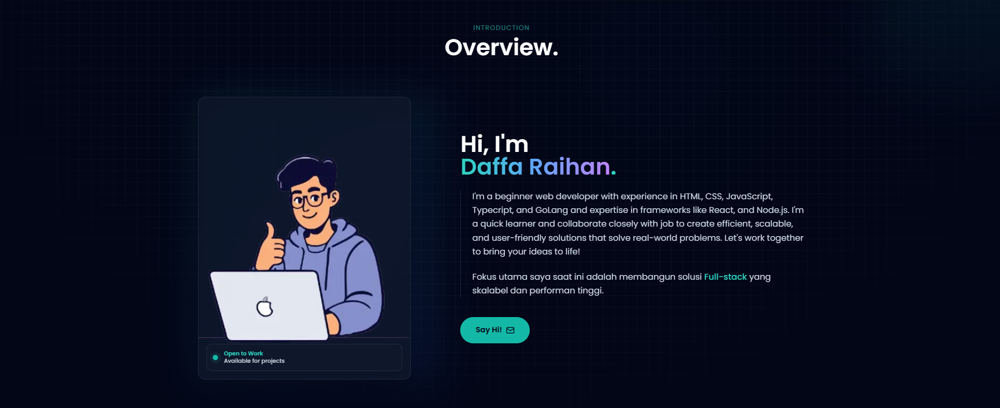

🚀 Raiiynnn Portfolio

Sebuah portofolio interaktif yang menggabungkan desain modern, animasi halus, dan performa tinggi untuk menampilkan perjalanan profesional saya sebagai IT Solution Enabler.

🌟 Preview

Jelajahi portofolio ini secara langsung di: Portfolio Saya(https://raiiynnn-portfolio.vercel.app/)]

💻 Tech Stack

Framework: [Next.js](https://nextjs.org/)
Styling: [TailwindCSS](https://tailwindcss.com/)
Deployment: [Vercel](https://vercel.com/)
Icons: Custom SVG & Simple Icons

🎯 Fitur Utama

⚡ Performa Tinggi: Dibangun di atas Next.js App Router untuk rendering yang cepat.

🎨 UI/UX Modern: Desain responsif dengan efek glassmorphism, gradient borders, dan spotlight hover effects.

📱 Fully Responsive: Tampilan yang adaptif sempurna dari mobile hingga desktop.

✨ Animasi Interaktif: Menggunakan custom hook RevealOnScroll untuk transisi elemen yang mulus.

📂 Dynamic Project Showcase: Menampilkan proyek unggulan dengan detail teknologi yang digunakan.

💼 Experience Timeline: Visualisasi perjalanan karir yang rapi dan mudah dibaca.

🛠️ Instalasi & Setup

Ikuti langkah-langkah berikut untuk menjalankan proyek ini di komputer lokal Anda:

1. Clone Repository

git clone [https://github.com/Raiiynn/nama-repo-anda.git](https://github.com/Raiiynn/nama-repo-anda.git)
cd nama-repo-anda

2. Install Dependencies

npm install
# atau
yarn install

3. Jalankan Development Server

npm run dev

Buka http://localhost:3000 di browser Anda untuk melihat hasilnya.

4. Build untuk Production

npm run build
npm start

📁 Struktur Proyek

Berikut adalah gambaran umum struktur direktori proyek ini:

/
├── src/
│   ├── app/
│   │   ├── layout.tsx       # Layout utama & Metadata
│   │   ├── page.tsx         # Halaman utama (Landing Page)
│   │   └── data.ts          # Sentralisasi data (Profil, Proyek, Skill)
│   ├── components/
│   │   ├── hero-section.tsx       # Bagian Intro & Animasi Teks
│   │   ├── about-section.tsx      # Profil, Stats, & Experience
│   │   ├── skills-section.tsx     # Tech Stack Grid
│   │   ├── projects-section.tsx   # Galeri Proyek
│   │   ├── contact-section.tsx    # Informasi Kontak
│   │   ├── navbar.tsx             # Navigasi Responsif
│   │   ├── reveal-on-scroll.tsx   # Komponen Animasi
│   │   └── ...
├── public/                  # Aset statis (Gambar, Logo)
├── next.config.ts           # Konfigurasi Next.js
├── tailwind.config.ts       # Konfigurasi Tailwind
└── package.json

📝 Kustomisasi Konten

Seluruh konten teks dan data proyek dikelola secara terpusat agar mudah diubah tanpa menyentuh logika kode.

Data Profil & Proyek: Edit file src/app/data.ts.

Gambar: Simpan gambar baru di folder public/ dan perbarui referensinya di data.ts atau komponen terkait.

📫 Kontak

Tertarik untuk berkolaborasi atau memiliki pertanyaan? Hubungi saya di:

📧 Email: daffaraihan72@gmail.com

🔗 LinkedIn: Daffa Raihan Ramadhan

🐙 GitHub: @Raiiynn

📄 Lisensi

Proyek ini bersifat open-source dan tersedia di bawah lisensi MIT. Silakan gunakan, modifikasi, dan pelajari kodenya!

Dibuat dengan ❤️ oleh Daffa Raihan Ramadhan